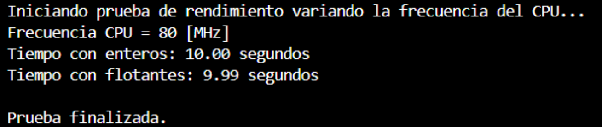
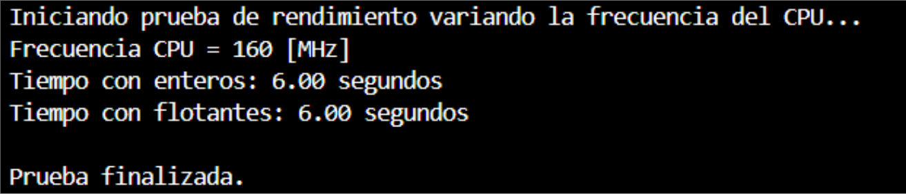
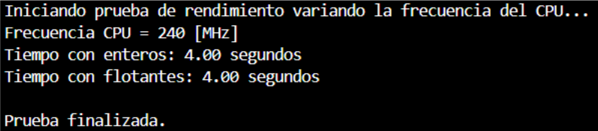
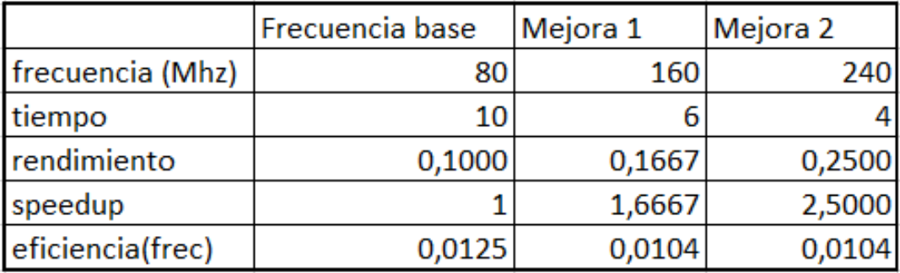

# Trabajo Práctico N°1

## Introducción
Este informe tiene como propósito aplicar los conocimientos sobre rendimiento y performance de los sistemas computacionales, permitiendo tomar decisiones fundamentadas sobre el hardware y mejorar la eficiencia del código.

La tarea se divide en tres secciones:

Evaluar y comparar el rendimiento de diferentes componentes de hardware utilizando benchmarks de terceros.

Analizar el desempeño de nuestro propio código con herramientas de time profiling.

Realizar una actividad práctica con una ESP32, estudiando su rendimiento en distintas condiciones.

## Desarrollo

**Consigna 1:**
En un informe deberán responder a las siguientes preguntas y mostrar con capturas de pantalla la realización del tutorial descripto en time profiling adjuntando las conclusiones sobre el uso del tiempo de las funciones.

Armar una lista de benchmarks, ¿cuales les serían más útiles a cada uno ? ¿Cuáles podrían llegar a medir mejor las tareas que ustedes realizan a diario ? 

Pensar en las tareas que cada uno realiza a diario y escribir en una tabla de dos entradas las tareas y que benchmark la representa mejor.

Cual es el rendimiento de estos procesadores para compilar el kernel de linux ?
Intel Core i5-13600K
AMD Ryzen 9 5900X 12-Core
Cual es la aceleración cuando usamos un AMD Ryzen 9 7950X 16-Core
https://openbenchmarking.org/test/pts/build-linux-kernel-1.15.0

El trabajo es grupal. Los grupos son de hasta tres personas. Cada grupo puede tener hasta una persona cursando ingeniería electrónica. 
Deben colocar sus nombres y el nombre de sus grupos en el archivo cronograma y grupos.
Cada uno de los integrantes tendrá un repositorio individual sincronizado con el resto de su equipo.
En el archivo resultados deben colocar los resultados de las mediciones de sus computadoras de manera indiviudal

Alguno de los Benchmarks mas utilizados, para medir rendimiento en un PC son:
SPEC CPU: Centrado en pruebas de computacion pura (calculos) y no esta orientado a aplicaciones graficas o de uso diarios.
Geekbench: Enfoque multiplataforma y simplificado en la ejecucion, lo cual lo hace ideal para usuarios que buscan resultados rapidos y comparables entre distintos dispositivos.
Cinebench: Se centra exclusivamente en el rendimiento en renderizado 3D, ofreciendo una metrica especifica para aplicaciones creativas.
3DMark: Su enfoque esta en el rendimiento de la tarjeta grafica y la experiencia de juego, a diferencia de los benchmarks puramente orientados a la CPU.
PCMark: Se centra en el rendimiento global del sistema, evaluando hardware y software en contextos de uso real.

Según nuestro punto de vista, los benchmarks más útiles podrían ser Geekbench o PCMark. 
PCMark es generalmente el benchmark más adecuado para medir el rendimiento en tareas diarias, ya que simula escenarios de uso real. Mientras que Geekbench también puede ser útil para tener una idea rápida de la capacidad de procesamiento general del sistema.

A la hora de compilar el kernel de linux con los procesadores Intel Core i5-13600K, AMD Ryzen 9 5900X 12-Core y AMD Ryzen 9 7950X 16-Core, se obtienen los siguientes tiempos

**Consigna 2:**

Vamos a empezar por una frecuencia de 80 [MHz] en la ESP32:

Mejorando a una frecuencia de 160 [MHz]:

Y aumentando a una frecuencia de 240 [MHz]:

Con esto, generamos una tabla para poder observar el rendimiento, el speedup y la eficiencia:

De acá podemos observar cómo a medida que aumentamos la frecuencia del ESP32, aumenta la velocidad de procesamiento, el rendimiento y el speedup. También podemos observar cómo se mantiene la eficiencia para las mejoras 1 y 2.

**SECCIÓN: Time Profiling**

En esta sección cada uno de los integrantes realizó la misma experiencia, pero mostraremos imágenes de solo 1 para evitar repeticiones.

Parte de la actividad fue realizada por el tutorial brindado por la catedra.

La opción -pg en GCC activa la generación de información de perfilado para el programa, permitiendo analizar su rendimiento con gprof.

Luego de ejecutarlo se prosigue a crear el archivo gmoun.out

Posteriormente ejecutamos la herramienta gprof que permite analizar el rendimiento de programas en C. Cuanto tiempo, cuantas veces y cuellos de botella.
Generando asi un archivo txt el cual sirve para analizar lo anteriormente mencionado.

**ARCHIVO:** analysis_CG.txt 

**-------------------------------------------------------------------------------------------------------------------------------------------------------------------------------------------------**
Flat profile:

Each sample counts as 0.01 seconds.
  %   cumulative   self              self     total           
 time   seconds   seconds    calls   s/call   s/call  name    
 36.60      9.60     9.60        1     9.60     9.60  new_func1
 33.51     18.39     8.79        1     8.79     8.79  func2
 29.78     26.20     7.81        1     7.81    17.41  func1
  0.11     26.23     0.03                             main

 %         the percentage of the total running time of the
time       program used by this function.

cumulative a running sum of the number of seconds accounted
 seconds   for by this function and those listed above it.

 self      the number of seconds accounted for by this
seconds    function alone.  This is the major sort for this
           listing.

calls      the number of times this function was invoked, if
           this function is profiled, else blank.

 self      the average number of milliseconds spent in this
ms/call    function per call, if this function is profiled,
	   else blank.

 total     the average number of milliseconds spent in this
ms/call    function and its descendents per call, if this
	   function is profiled, else blank.

name       the name of the function.  This is the minor sort
           for this listing. The index shows the location of
	   the function in the gprof listing. If the index is
	   in parenthesis it shows where it would appear in
	   the gprof listing if it were to be printed.
Copyright (C) 2012-2024 Free Software Foundation, Inc.

Copying and distribution of this file, with or without modification,
are permitted in any medium without royalty provided the copyright
notice and this notice are preserved.
		     Call graph (explanation follows)

granularity: each sample hit covers 4 byte(s) for 0.04% of 26.23 seconds

index % time    self  children    called     name
                                                 <spontaneous>
[1]    100.0    0.03   26.20                 main [1]
                7.81    9.60       1/1           func1 [2]
                8.79    0.00       1/1           func2 [4]
-----------------------------------------------
                7.81    9.60       1/1           main [1]
[2]     66.4    7.81    9.60       1         func1 [2]
                9.60    0.00       1/1           new_func1 [3]
-----------------------------------------------
                9.60    0.00       1/1           func1 [2]
[3]     36.6    9.60    0.00       1         new_func1 [3]
-----------------------------------------------
                8.79    0.00       1/1           main [1]
[4]     33.5    8.79    0.00       1         func2 [4]
-----------------------------------------------

 This table describes the call tree of the program, and was sorted by
 the total amount of time spent in each function and its children.

 Each entry in this table consists of several lines.  The line with the
 index number at the left hand margin lists the current function.
 The lines above it list the functions that called this function,
 and the lines below it list the functions this one called.
 This line lists:
     index	A unique number given to each element of the table.
		Index numbers are sorted numerically.
		The index number is printed next to every function name so
		it is easier to look up where the function is in the table.

     % time	This is the percentage of the `total' time that was spent
		in this function and its children.  Note that due to
		different viewpoints, functions excluded by options, etc,
		these numbers will NOT add up to 100%.

     self	This is the total amount of time spent in this function.

     children	This is the total amount of time propagated into this
		function by its children.

     called	This is the number of times the function was called.
		If the function called itself recursively, the number
		only includes non-recursive calls, and is followed by
		a `+' and the number of recursive calls.

     name	The name of the current function.  The index number is
		printed after it.  If the function is a member of a
		cycle, the cycle number is printed between the
		function's name and the index number.

 For the function's parents, the fields have the following meanings:

     self	This is the amount of time that was propagated directly
		from the function into this parent.

     children	This is the amount of time that was propagated from
		the function's children into this parent.

     called	This is the number of times this parent called the
		function `/' the total number of times the function
		was called.  Recursive calls to the function are not
		included in the number after the `/'.

     name	This is the name of the parent.  The parent's index
		number is printed after it.  If the parent is a
		member of a cycle, the cycle number is printed between
		the name and the index number.

 If the parents of the function cannot be determined, the word
 `<spontaneous>' is printed in the `name' field, and all the other
 fields are blank.

 For the function's children, the fields have the following meanings:

     self	This is the amount of time that was propagated directly
		from the child into the function.

     children	This is the amount of time that was propagated from the
		child's children to the function.

     called	This is the number of times the function called
		this child `/' the total number of times the child
		was called.  Recursive calls by the child are not
		listed in the number after the `/'.

     name	This is the name of the child.  The child's index
		number is printed after it.  If the child is a
		member of a cycle, the cycle number is printed
		between the name and the index number.

 If there are any cycles (circles) in the call graph, there is an
 entry for the cycle-as-a-whole.  This entry shows who called the
 cycle (as parents) and the members of the cycle (as children.)
 The `+' recursive calls entry shows the number of function calls that
 were internal to the cycle, and the calls entry for each member shows,
 for that member, how many times it was called from other members of
 the cycle.
Copyright (C) 2012-2024 Free Software Foundation, Inc.

Copying and distribution of this file, with or without modification,
are permitted in any medium without royalty provided the copyright
notice and this notice are preserved.
Index by function name

   [2] func1                   [1] main
   [4] func2                   [3] new_func1
   
**-------------------------------------------------------------------------------------------------------------------------------------------------------------------------------------------------**
Dicho archivo es posible resumirlo de distintas maneras y optamos por graficarlo para un mejor entendimiento con el siguiente comando generando así un archivo png.

Gráfico generado:  muestra la relación entre funciones y el tiempo que consumen en la ejecución del programa.

